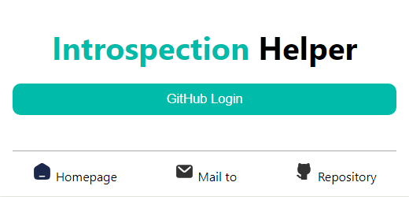
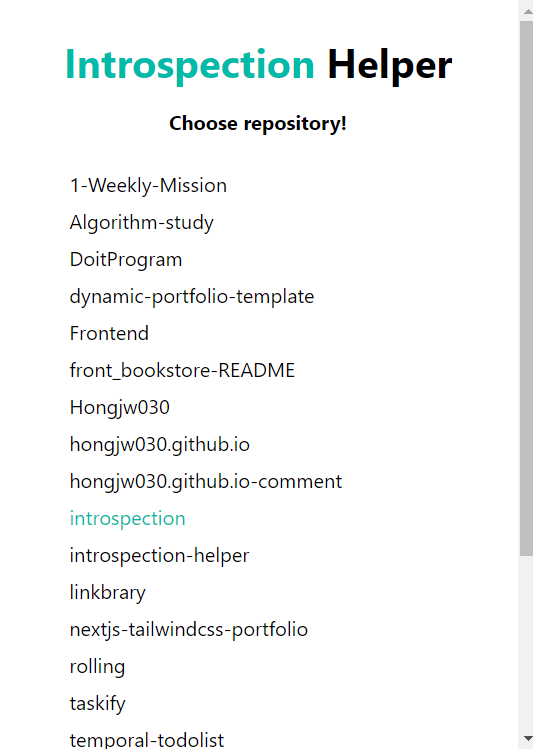
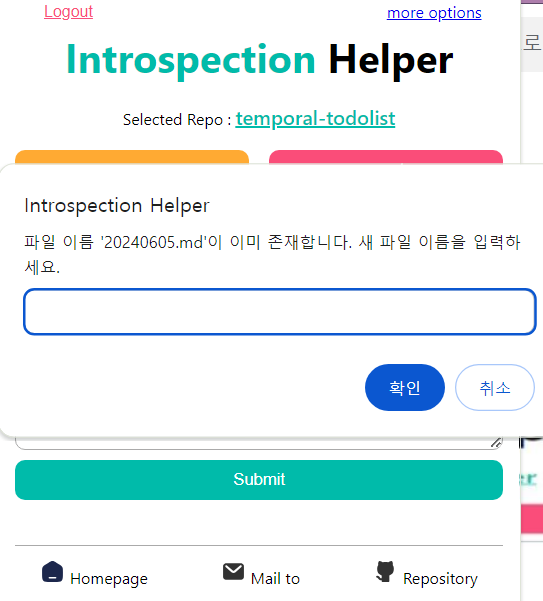
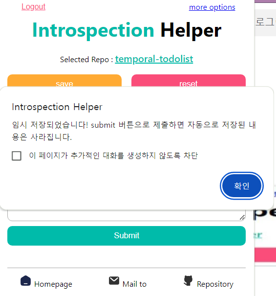

<h2 align="center">
  
   
  Introspection Helper
  <h4 align="center">크롬 익스텐션으로 빠르게 회고를 작성하세요!</h4>
   
</h2>

## 목차
1. [Introspection Helper](#Introspection-Helper란)
2. [크롬 마켓](#크롬-마켓에서-설치하기)
3. [기본 사용법](#기본_사용법)
4. [옵션 설정법](#옵션-설정법)
   1. [폴더 이름 커스텀하는 법](#1-폴더-이름을-커스텀하고-싶어요)
   2. [파일 이름 커스텀하는 법](#2-파일-이름을-커스텀하고-싶어요)
   3. [커밋 메세지 커스텀하는 법](#3-커밋-메세지를-커스텀하고-싶어요)
   4. [회고 템플릿 커스텀 하는 법](#4-회고-템플릿을-만들어서-쓰고-싶어요)
   5. [오늘 회고 작성했는지 확인하는 법](#5-오늘-회고를-작성했는지-안했는지-보고-싶어요)
   6. [라이트, 다크 모드 설정하는 법](#6-라이트-모드--다크-모드를-설정하고-싶어요)
5. [문의](#문의)
6. [컨벤션](#컨벤션)

## Introspection Helper란?

매일매일 회고를 쓰려 해도 자꾸만 까먹는 분들을 위해 (제 얘기입니다) 만든 크롬 익스텐션입니다. 익스텐션 입력창에 간단한 마크다운 형식의 회고를 작성하고 제출하면, 연결된 레파지토리에 자동으로 커밋됩니다.

이 프로젝트는 MIT 라이선스에 따라 라이선스가 부여됩니다. 자세한 내용은 [LICENSE](./LICENSE) 파일을 참조하세요.

 
 

---

## 크롬 마켓에서 설치하기

해당 링크에서 설치할 수 있습니다. 

[크롬 마켓 바로 가기](https://chromewebstore.google.com/detail/introspection-helper/gifbolfogdiniebgljncdinaehkciohk?hl=ko)

 
 

---

## 기본 사용법 
(로그인, 레포 선택, that's it!! 이제 input에 글을 쓰고 commit하세요. 날짜별로 자동으로 year/month 폴더가 생성됩니다. 만약 하루에 두 번 commit하려 하면 파일이름이 중복돼요. 그럼 prompt 창이 떠서 새 이름을 입력할 수도 있습니다.)

1. `Github Login` 버튼을 눌러 깃허브 로그인을 진행해주세요.

2. 회고를 올릴 레포지토리를 선택해주세요.

3. 이제 마크다운 형식으로 글을 쓰고 `submit 버튼`을 누르면, 자동으로 글이 push됩니다! submit 한 날짜에 따라 {year} 폴더, {month} 폴더가 생성되고, 그 안에 오늘자 회고.md 파일이 생성됩니다. 

4. 만약 하루에 여러 번 submit 하면 동일한 이름의 파일이 존재하기 때문에 새 이름을 입력하라는 prompt 창이 뜹니다.

5. 글을 임시 저장하고 싶다면 `save 버튼`을 눌러주세요. (단, submit 버튼으로 글을 push하면 saved text는 삭제됩니다!)

6. 다른 레포지토리와 연결하고 싶다면 `Logout` 버튼을 눌러 로그아웃하고 다시 연결해주세요.

7. 옵션을 설정하고 싶다면 `more options` 버튼을 눌러주세요.

 
 

---

## 옵션 설정법
#### 1. 폴더 이름을 커스텀하고 싶어요.
~~현재 폴더 이름은 자동으로 year/month 로 설정됩니다. 예를 들어 2024.05.21 날짜에 회고를 작성하면 2024/05폴더가 생성되고, 그 안에 20240521.md 파일이 생성됩니다.~~
~~만약 폴더 이름을 커스텀하고 싶다면 이렇게 진행해주세요!~~

개발 진행 중입니다.

#### 2. 파일 이름을 커스텀하고 싶어요.
~~현재 파일 이름은 자동으로 {year}{month}{day}.md 파일로 설정됩니다. 예를 들어 2024.05.21 날짜에 회고를 작성하면 20240521.md 파일이 생성됩니다.~~
~~만약 파일 이름을 커스텀하고 싶다면 이렇게 진행해주세요!~~

개발 진행 중입니다.

#### 3. 커밋 메세지를 커스텀하고 싶어요.
현재 커밋 메세지는 `Create new file` 로 설정되어있습니다. 만약 이를 수정하고 싶다면 이렇게 진행해주세요!
1. go to option-> 버튼을 눌러 option 페이지로 이동해주세요.
2. Commit Option에 커밋 메세지를 입력하고, save 버튼을 눌러주세요.
3. 이제 커밋 메세지는 계속 저장됩니다! 앞으로 회고 파일을 submit하면, 설정한 커밋 메세지로 push돼요. 단, 로그아웃을 하면 커밋 메세지는 삭제돼요.
4. 만약 설정한 커밋 메세지를 없애고 싶다면 reset 버튼을 눌러주세요.
5. 커밋 메세지는 공백일 수 없습니다. 공백인 채로 save 버튼을 누르면 설정할 수 없다는 alert 창이 떠요.

#### 4. 회고 템플릿을 사용하고 싶어요.
기본적으로는 아무 템플릿도 제공되지 않습니다. 만약 템플릿을 사용하고 싶다면 이렇게 진행해주세요!
1. go to option-> 버튼을 눌러 option 페이지로 이동해주세요.
2. Template Option에 회고 양식을 입력하고, save 버튼을 눌러주세요.
3. 이제 템플릿은 계속 저장됩니다! 단, 로그아웃을 하면 템플릿은 삭제돼요.
4. 만약 template을 없애고 싶다면 reset 버튼을 눌러주세요.

#### 5. 오늘 회고를 작성했는지 안했는지 보고 싶어요.
오늘 회고를 작성했는지, 안 했는지 보고 싶은 분들은 이렇게 진행해주세요!
1. go to option-> 버튼을 눌러 option 페이지로 이동해주세요.
2. Time Option에 `Check to know if you'v write introspection!` 을 눌러주세요.
3. 다시 popup 페이지로 오면, 적용된 걸 확인할 수 있어요! 단, 로그아웃을 하면 기록은 초기화돼요.
4. 회고 작성 여부 기준은, `오늘 submit 버튼을 눌러 push를 진행했느냐, 안했느냐` 예요. 즉, 익스텐션을 사용하지 않고 레포지토리에 직접 회고글을 올리면 회고 작성 여부가 반영되지 않아요. 

#### 6. 라이트 모드 / 다크 모드를 설정하고 싶어요
오늘 회고를 작성했는지, 안 했는지 보고 싶은 분들은 이렇게 진행해주세요!
1. go to option-> 버튼을 눌러 option 페이지로 이동해주세요.
2. Time Option에 `Check to know if you'v write introspection!` 을 눌러주세요.
3. 다시 popup 페이지로 오면, 적용된 걸 확인할 수 있어요! 단, 로그아웃을 하면 기록은 초기화돼요.
4. 회고 작성 여부 기준은, `오늘 submit 버튼을 눌러 push를 진행했느냐, 안했느냐` 예요. 즉, 익스텐션을 사용하지 않고 레포지토리에 직접 회고글을 올리면 회고 작성 여부가 반영되지 않아요. 

 
 

---

## 문의

문제가 생겼다면 Issues -> Bug report 템플릿을 활용해주세요.
 
제안하고 싶은 게 있다면 Issues -> feat request 템플릿을 활용해주세요.

 
 

---

## 컨벤션

#### 커밋 메세지 컨벤션
- **feat**: 새로운 기능 추가
- **fix**: 버그 수정
- **docs**: 문서 수정
- **style**: 코드 포맷팅 (코드 변경 없음)
- **design**: 디자인 수정 (기능 변경 없음)
- **refactor**: 코드 리팩토링 (기능 변경 없음)
- **rename**: 변수명, 클래스명, 파일명 등 이름 수정 (기능 변경 없음)
- **test**: 테스트 추가 또는 수정
- **chore**: 빌드 프로세스 또는 보조 도구 변경
- **delete**: 파일 및 코드 삭제

## 네이밍 컨벤션
- 변수 및 함수 이름: camelCase (예: myFunction)
- id 이름: kebab-case (예: main-header)
- class 이름: BEM (예: nav__item nav__item--active)
- 상수: UPPER_SNAKE_CASE (예: MAX_VALUE)