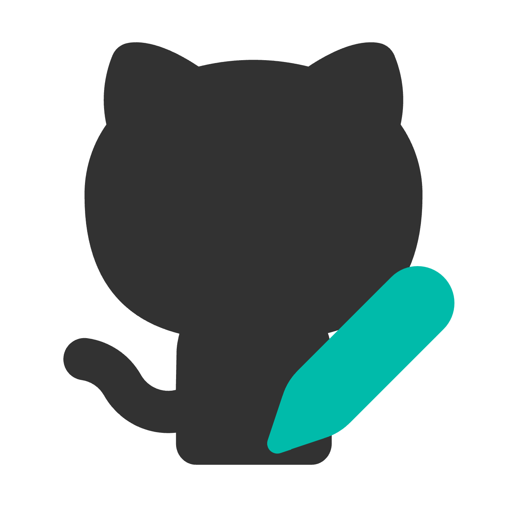

<h2 align="center">
  
   
  Introspection Helper
  <h4 align="center">크롬 익스텐션으로 빠르게 회고를 작성하세요!</h4>
   
</h2>

## 목차
1. [Introspection Helper](#Introspection-Helper란)
2. [크롬 마켓](#크롬-마켓에서-설치하기)
3. [기본 사용법](#기본_사용법)
4. [옵션 설정법](#옵션-설정법)
   1. [폴더 이름 커스텀하는 법](#1-폴더-이름을-커스텀하고-싶어요)
   2. [파일 이름 커스텀하는 법](#2-파일-이름을-커스텀하고-싶어요)
   3. [커밋 메세지 커스텀하는 법](#3-커밋-메세지를-커스텀하고-싶어요)
   4. [회고 템플릿 커스텀 하는 법](#4-회고-템플릿을-만들어서-쓰고-싶어요)
   5. [오늘 회고 작성했는지 확인하는 법](#5-오늘-회고를-작성했는지-안했는지-보고-싶어요)
   6. [라이트, 다크 모드 설정하는 법](#6-라이트-모드--다크-모드를-설정하고-싶어요)
5. [문의](#문의)
6. [컨벤션](#컨벤션)

## Introspection Helper란?

매일매일 회고를 쓰려 해도 자꾸만 까먹는 분들을 위해 (제 얘기입니다) 만든 크롬 익스텐션입니다. 익스텐션 입력창에 간단한 마크다운 형식의 회고를 작성하고 제출하면, 연결된 레파지토리에 자동으로 커밋됩니다.

이 프로젝트는 MIT 라이선스에 따라 라이선스가 부여됩니다. 자세한 내용은 [LICENSE](./LICENSE) 파일을 참조하세요.

 
 

---

## 크롬 마켓에서 설치하기

해당 링크에서 설치할 수 있습니다. 

[크롬 마켓 바로 가기](https://chromewebstore.google.com/detail/introspection-helper/gifbolfogdiniebgljncdinaehkciohk?hl=ko)

 
 

---

## 기본 사용법 

자세한 사용법은 [노션 튜토리얼](https://deeply-zydeco-4bb.notion.site/Introspection-Helper-d2b2e5ec8af44455a64b3b1c8106478a?pvs=74) 이 링크를 참조해주세요.

1. `Github Login` 버튼을 눌러 깃허브 로그인을 진행해주세요.

2. 회고를 올릴 레포지토리를 선택해주세요.

3. 이제 마크다운 형식으로 글을 쓰고 `submit 버튼`을 누르면, 자동으로 글이 push됩니다! submit 한 날짜에 따라 {year} 폴더, {month} 폴더가 생성되고, 그 안에 오늘자 회고.md 파일이 생성됩니다. 

4. 만약 하루에 여러 번 submit 하면 동일한 이름의 파일이 존재하기 때문에 새 이름을 입력하라는 prompt 창이 뜹니다.

5. 글을 임시 저장하고 싶다면 `save 버튼`을 눌러주세요. (단, submit 버튼으로 글을 push하면 saved text는 삭제됩니다!)

6. 다른 레포지토리와 연결하고 싶다면 `Logout` 버튼을 눌러 로그아웃하고 다시 연결해주세요.

7. 옵션을 설정하고 싶다면 `more options` 버튼을 눌러주세요.

 
 

---

## 문의

문제가 생겼다면 Issues -> Bug report 템플릿을 활용해주세요.
 
 
제안하고 싶은 게 있다면 Issues -> feat request 템플릿을 활용해주세요.

 
 

---

## 컨벤션

#### 커밋 메세지 컨벤션
- **feat**: 새로운 기능 추가
- **fix**: 버그 수정
- **docs**: 문서 수정
- **style**: 코드 포맷팅 (코드 변경 없음)
- **design**: 디자인 수정 (기능 변경 없음)
- **refactor**: 코드 리팩토링 (기능 변경 없음)
- **rename**: 변수명, 클래스명, 파일명 등 이름 수정 (기능 변경 없음)
- **test**: 테스트 추가 또는 수정
- **chore**: 빌드 프로세스 또는 보조 도구 변경
- **delete**: 파일 및 코드 삭제

## 네이밍 컨벤션
- 변수 및 함수 이름: camelCase (예: myFunction)
- id 이름: kebab-case (예: main-header)
- class 이름: BEM (예: nav__item nav__item--active)
- 상수: UPPER_SNAKE_CASE (예: MAX_VALUE)